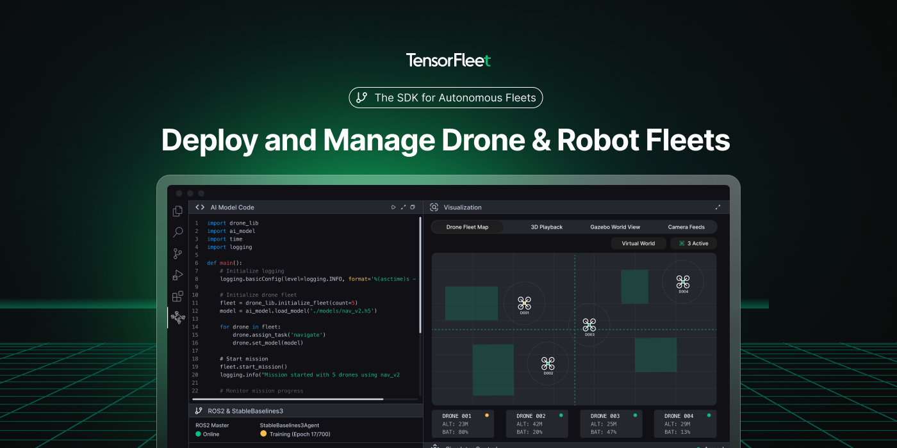

# TensorFleet Robotics & Drone Suite for VS Code

### Build, simulate, and operate PX4-powered drones and robots - all inside VS Code.
TensorFleet brings a full robotics and drone- development environment directly into Visual Studio Code. Create new PX4-based drone and robotics projects in seconds, visualize simulations in 3D, inspect ROS topics with powerful diff tools, teleoperate robots, and deploy missions **without ever leaving the editor.**

Whether you're building drone autonomy, ROS 2 pipelines, or perception demos, TensorFleet gives you a production-grade cockpit for robotics development.

Support for PX4 is built in today, with ArduPilot support coming soon!

---

## 🚀 Key Features
### Quick-Start Robotics Projects
Spin up ready-to-fly workspaces with curated boilerplates for drones, robots, missions, and perception tasks. Everything launches pre-wired with folders, templates, and dashboards.
### Integrated Simulation (Gazebo + Web Viewer)
Render and interact with your simulation world directly in VS Code.
- View 3D scenes
- Inspect objects and sensors
- Connect instantly via GzWeb
- Control or monitor your robot in real time

###  Mission Control & Flight Dashboard

A modern GCS-like interface with:
- Arm/disarm & mode switching (AUTO, LOITER, MISSION, etc.)
- PX4 telemetry (GPS, battery, heading, altitude, RC status)
- Flight events and arming checks
- Mission transitions and auto takeoff
Built for PX4, ArduPilot, MAVLink & GCS workflows.

### ROS 2 Tooling for Autonomy Development
Everything you expect from a robotics IDE - but smoother:
- Raw topic message viewer
- Realtime diffs between messages
- Image viewer with camera model overlays
- Teleoperation panel for publishing `cmd_vel`
- ROS 2 & mission tooling bundled for offline work

### Maps, Sensors and Live Drone Telemetry in One Place
View robots on a live map, inspect their state, overlay mission points, and stream camera feeds all from dedicated panels.

### Drone-Ready Quick Start (PX4 Support)
Spin up ready-to-fly drone workspaces with boilerplates for missions, autonomy, perception, and ROS 2 stacks - all preconfigured for PX4.

Support for ArduPilot is planned.

### Bundled Toolchain Installer
One-click installation of the entire ROS 2 + mission toolchain.
No more environment juggling.

---

### 🔧 Perfect For
- Robotics startups building autonomy stacks
- Drone operators & mission-planning teams
- PX4/ArduPilot autonomy
- ROS 2 developers
- Students & researchers
- Anyone tired of switching between 10+ robotics tools

---

## Contributing

TensorFleet is an actively developed robotics and drone platform, and we welcome contributions from the community.  
Bug reports, feature requests, and pull requests all help shape the future of the extension. Thank you for your support!

### Development Guide

Want to work on the TensorFleet VS Code extension?  
Follow the **Development Guide** to get started with building, running, and packaging the extension:

➡️ **[CONTRIBUTING_DOC.md - Build & Development Steps](CONTRIBUTING_DOC.md)**

This guide covers:

- Installing dependencies with Bun  
- Compiling and watching the extension  
- Launching the Extension Development Host  
- Running all TensorFleet dashboards in VS Code  
- Drone project scaffolding  
- Bundled tool installer  
- VM Manager integration  
- Packaging (`vsix`)  
- MCP server setup for AI-assisted workflows  

If you have questions or want to propose improvements, feel free to open an issue or discussion. We’d love to hear from you!

---

## 🌐 Learn More

Documentation, examples, and guides are available at
https://tensorfleet.net