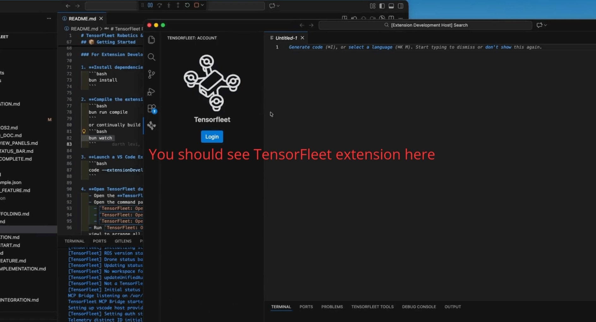

# TensorFleet Robotics & Drone Suite for VS Code


### Build, simulate, and operate PX4-powered drones and robots — all inside VS Code.

TensorFleet brings a full robotics and drone-development environment directly into Visual Studio Code. Create new PX4-based drone and robotics projects in seconds, visualize simulations in 3D, inspect ROS topics with powerful diff tools, teleoperate robots, and deploy missions **without ever leaving the editor.**

Whether you're building drone autonomy, ROS 2 pipelines, or perception demos, TensorFleet gives you a production-grade cockpit for robotics development.

Support for **PX4** is built in today, with **ArduPilot** support coming soon (ArduPilot support is planned!).

---

## 🚀 Key Features

### Quick-Start Robotics Projects
Spin up ready-to-fly workspaces with curated boilerplates for drones, robots, missions, and perception tasks. Everything launches pre-wired with folders, templates, and dashboards.

### Integrated Simulation (Gazebo + Web Viewer)
Render and interact with your simulation world directly in VS Code:
- View 3D scenes  
- Inspect objects and sensors  
- Connect instantly via GzWeb  
- Control or monitor your robot in real time  

### Mission Control & Flight Dashboard
A modern GCS-like interface with:
- Arm/disarm & mode switching (AUTO, LOITER, MISSION, etc.)
- PX4 telemetry (GPS, battery, heading, altitude, RC status)
- Flight events and arming checks
- Mission transitions and auto takeoff  

Built for PX4, ArduPilot, MAVLink & GCS workflows.

### ROS 2 Tooling for Autonomy Development
Everything you expect from a robotics IDE — but smoother:
- Raw topic message viewer  
- Realtime diffs between messages  
- Image viewer with camera model overlays  
- Teleoperation panel for publishing `cmd_vel`  
- ROS 2 & mission tooling bundled for offline work  

### Maps, Sensors and Live Drone Telemetry in One Place
View robots on a live map, inspect their state, overlay mission points, and stream camera feeds all from dedicated panels.

### Drone-Ready Quick Start (PX4 Support)
Spin up ready-to-fly drone workspaces with boilerplates for missions, autonomy, perception, and ROS 2 stacks — all preconfigured for PX4.

### Bundled Toolchain Installer
One-click installation of the entire ROS 2 + mission toolchain.  
No more environment juggling or shell acrobatics.

---

### 🔧 Perfect For

- Robotics startups building autonomy stacks  
- Drone operators & mission-planning teams  
- PX4/ArduPilot autonomy workflows  
- ROS 2 developers  
- Students & researchers  
- Anyone tired of switching between 10+ robotics tools  

---

## 📦 Getting Started

### For Extension Development
<!-- for mp4 vfile 
[](media/bun-watch.mp4)
-->

<!-- for gif file 

-->

1. **Install dependencies with Bun:**
   ```bash
   bun install
   ```

2. **Compile the extension:**
   ```bash
   bun run compile
   ```
   or continually build the code:
   ```bash
   bun watch
   ```

3. **Launch a VS Code Extension Development Host:**
   ```bash
   code --extensionDevelopmentPath="$(pwd)"
   ```

4. **Open TensorFleet dashboards in VS Code:**
   - Open the **TensorFleet** activity bar item to access the dashboards, or  
   - Open the command palette (`Cmd/Ctrl + Shift + P`) and run:
     - `TensorFleet: Open QGroundControl Workspace`
     - `TensorFleet: Open Gazebo Workspace`
     - `TensorFleet: Open AI Ops Workspace`
   - Run `TensorFleet: Open All Dashboards in Main Area` (or press the **Open All Dashboards** button in any TensorFleet view) to arrange all four dashboards — including the ROS 2 & Stable Baselines lab — in a quad layout.

---

### For Drone Development (Using the Extension)

1. **Create a New Project**
   - Open the **TensorFleet Tools** panel (bottom panel)  
   - Click the **🚀 New Project** button  
   - Enter a project name and select a location  
   - Get a complete project with templates, examples, and configuration!

   📚 **[Project Scaffolding Guide →](./PROJECT_SCAFFOLDING.md)** — Learn about project templates.

2. **Configure Your Environment**  
   Edit your drone configuration file:
   ```text
   config/drone_config.yaml
   ```

3. **Launch Tools**  
   Use TensorFleet panels to start Gazebo, ROS 2, and AI operations.

4. **Start Coding**  
   Implement your drone control logic in:
   ```text
   src/main.py
   ```

---

## Bundled Tool Installer

The command `TensorFleet: Install Bundled Tools` prompts for a destination folder and copies all files from `resources/tools` into a `tensorfleet-tools` directory at the chosen location.

Replace the placeholder files in `resources/tools/` with your actual ROS 2 archives and supporting binaries **before packaging** the extension.

---

## VM Manager Integration

TensorFleet surfaces VM health through a lightweight status bar item — no extra panels to open or local daemons to manage.

1. **Configure the endpoint**
   - `tensorfleet.vmManager.apiBaseUrl`: base URL for the VM Manager API (defaults to `https://eu.vm.tensorfleet.net`).  
   - `tensorfleet.vmManager.authToken`: optional bearer token sent to `/vms/self/*` APIs when your server enforces JWT auth.

2. **Watch the status bar**  
   The indicator auto-polls every 30 seconds and rotates through intuitive states:
   - `🟡 VM Starting…`  
   - `🟢 VM Ready (ip)`  
   - `⚫ VM Stopped`  
   - `🔴 VM Failed`  
   - `$(debug-disconnect) VM Unreachable`

3. **Click for quick actions**  
   `TensorFleet: Show VM Actions` (or simply click the status bar item) opens a Quick Pick menu tuned to the current state:
   - **Running** → Connect via Remote SSH, Restart VM, Stop VM, Copy SSH command, Details, Support  
   - **Stopped** → Start VM, Details, Support  
   - **Starting/Stopping** → Busy indicator plus Details/Support  
   - **Failed** → Retry Start, Details, Support  
   - **Disconnected** → Retry Status, Support  

4. **Smart notifications**  
   When the backend reports major state changes (running, stopped, failed) you get a subtle toast so you know exactly when it’s safe to connect again.

Graceful degradation is built in — if the API can’t be reached you’ll see a **“VM Unreachable”** badge plus a Retry option in the quick menu. No local Go binary or sudo terminals required anymore.

---

## Packaging

To produce a `.vsix` package (requires `vsce`):

```bash
bunx vsce package
```

The resulting package can be installed in VS Code via the Extensions view  
(**“Install from VSIX...”**).

---

## MCP Server Integration

TensorFleet includes a **Model Context Protocol (MCP) server** that exposes drone operations, ROS 2, Gazebo simulation, and AI ops tools to AI assistants.

> **✨ NEW:** MCP tools automatically open VS Code panels! Ask Cursor “Start a Gazebo simulation” and watch the panel open automatically.

📚 **[Quick Start Guide →](./QUICK_START.md)** — Get set up in 5 minutes!

### Quick Setup

1. **Compile the extension** (if not already done):
   ```bash
   bun run compile
   ```

2. **Get MCP configuration**  
   Run the VS Code command:
   ```text
   TensorFleet: Show MCP Configuration
   ```
   This displays the JSON config to add to Cursor or Claude Desktop.

3. **Configure your AI assistant**
   - **Cursor**: Add the config to:
     ```text
     ~/.cursor/mcp.json
     ```
   - **Claude Desktop**: Add the config to:
     ```text
     ~/Library/Application Support/Claude/claude_desktop_config.json
     ```

4. **Restart** Cursor or Claude Desktop to load the TensorFleet MCP server.

### Available MCP Tools

The MCP server provides these tools to AI assistants:

- `get_drone_status` — Get drone battery, GPS, mode, and readiness  
- `launch_ros2_environment` — Launch ROS 2 packages for drone operations  
- `start_gazebo_simulation` — Start Gazebo with world and model  
- `run_ai_inference` — Run AI models on drone video feeds  
- `configure_qgc_mission` — Configure QGroundControl missions  
- `install_tensorfleet_tools` — Install bundled tools  
- `get_telemetry_data` — Get real-time telemetry data  

### MCP Resources

Contextual resources available to AI assistants:

- `tensorfleet://drone/config` — Drone configuration  
- `tensorfleet://ros2/topics` — Active ROS 2 topics  
- `tensorfleet://gazebo/models` — Available models and worlds  
- `tensorfleet://ai/models` — Available AI models  
- `tensorfleet://qgc/missions` — Saved missions  

### VS Code Integration

When the TensorFleet extension is running in VS Code, MCP tools will **automatically open the corresponding panels**.

For example, when an AI assistant calls `start_gazebo_simulation`, the Gazebo panel opens in VS Code automatically. This creates a seamless experience where your AI assistant controls your workspace.

### Full Documentation

- [QUICK_START.md](./QUICK_START.md) — Get started with TensorFleet in 5 minutes  
- [PROJECT_SCAFFOLDING.md](./PROJECT_SCAFFOLDING.md) — Create new drone projects with templates  
- [STATUS_BAR_FEATURE.md](./STATUS_BAR_FEATURE.md) — ROS version and drone status in the status bar  
- [MCP_SETUP.md](./MCP_SETUP.md) — Basic MCP setup for Cursor and Claude  
- [VSCODE_MCP_INTEGRATION.md](./VSCODE_MCP_INTEGRATION.md) — How MCP tools open VS Code panels automatically  

---

## Contributing

TensorFleet is an actively developed robotics and drone platform, and we welcome contributions from the community.  
Bug reports, feature requests, and pull requests all help shape the future of the extension. Thank you for your support!

### Development Guide

Want to work on the TensorFleet VS Code extension?  
Follow the **Development Guide** to get started with building, running, and packaging the extension:

➡️ **[CONTRIBUTING_DOC.md – Build & Development Steps](./CONTRIBUTING_DOC.md)**

This guide covers:

- Installing dependencies with Bun  
- Compiling and watching the extension  
- Launching the Extension Development Host  
- Running all TensorFleet dashboards in VS Code  
- Drone project scaffolding  
- Bundled tool installer  
- VM Manager integration  
- Packaging (`vsix`)  
- MCP server setup for AI-assisted workflows

### Development vs Production Builds

The extension supports **two levels** of dev/prod separation:

#### 1. Build-Time (`__DEV__`) — Code Stripping

Features wrapped in `if (__DEV__)` are **completely removed** from production packages:

```bash
bun run compile:dev   # Dev build (~1.3MB, includes debug code)
bun run compile:prod  # Prod build (~600KB, debug code stripped)
bun run package       # Uses prod build for marketplace
```

```typescript
// This entire block is removed in production builds
if (__DEV__) {
  registerDebugCommand();
  console.log('Debug mode active');
}
```

#### 2. Runtime (`isDev()`) — Behavior Changes

Same binary, different behavior based on how VS Code launches it:

```typescript
import { isDev, env } from './env';

// Code exists in prod, but only runs when debugging (F5)
if (isDev()) {
  showExtraDebugInfo();
}

// Dev-only logging (no-op in prod builds)
env.log('Debug:', data);
```

#### When to Use Which

| Use Case                           | Use                               |
| ---------------------------------- | --------------------------------- |
| Debug commands that shouldn't ship | `if (__DEV__)`                    |
| Local dev server region            | `isDev()` (runtime)               |
| Verbose logging                    | `env.log()` (build-time stripped) |
| Experimental features              | `if (__DEV__)`                    |

See `src/env.ts` for the full API including `registerDevCommand()`, `devOnly()`, `envSwitch()`, feature flags, and more.  

If you have questions or want to propose improvements, feel free to open an issue or discussion. We’d love to hear from you!

---

## 🌐 Learn More

Documentation, examples, and guides are available at:  
https://tensorfleet.net
