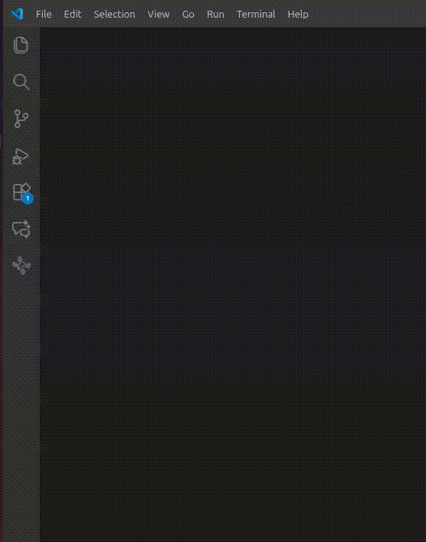
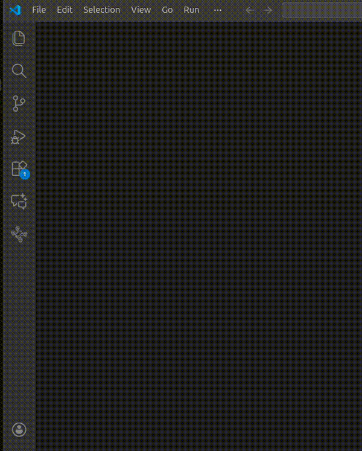

# TensorFleet LeRobot Arm Project

Control the SO-ARM101 robotic arm in simulation, with real hardware, or both.

| Track | What You Need |
|-------|---------------|
| 🎮 **A: Simulation Only** | Keyboard |
| 🦾 **B: Real Arm** | SO101 leader arm + USB |
| 🔗 **C: Sim + Real** | Leader + follower arms |

---

## Prerequisites
- **uv** package manager [install](https://docs.astral.sh/uv/getting-started/installation/): 
```
curl -LsSf https://astral.sh/uv/install.sh | sh
```
---

## Quick Start (All Tracks)

Complete these 3 steps before choosing your track.

### Step 1: Start the VM

1. Open the **TensorFleet** extension in the sidebar
2. Click **Open Server Settings** at the top
3. In **VM Controls**, click **Start VM**

> Wait for the VM status to show "Running" before proceeding.



### Step 2: Install Dependencies

```bash
uv venv && uv pip install -r requirements.txt
```

### Step 3: Open Simulation View

1. Open the **TensorFleet** extension in the sidebar
2. Click **Open Drone Views** at the top
3. Click **Simulation View**

**Or via Command Palette:** `TensorFleet: Open Simulation View`



> [!TIP]
> If the simulation doesn't appear after a while, close and re-open the panel. If the problem persists, restart the VM.

---

## 🎮 Track A: Simulation Only (Keyboard)

Run the teleoperation script:

```bash
uv run python src/teleop_so_arm101.py
```

Use [keyboard controls](#keyboard-controls) to move the arm. **The terminal must be focused** for keys to work.
✅ **Done!** You're controlling the simulated arm.

---

## 🦾 Track B: Real Arm Setup


> [!IMPORTANT]
> **Already set up your SO101?** Skip to [Configure Environment Variables](#configure-environment-variables) if you've completed motor setup and calibration.

### Prerequisites: SO101 Hardware Setup

Before using this project, your arm must have motors configured and calibrated.

👉 **Follow the official guide**: [HuggingFace SO101 Setup](https://huggingface.co/docs/lerobot/en/so101)

Complete these sections:
1. **Motor IDs & Baudrates** — `lerobot-setup-motors`
2. **Calibration** — `lerobot-calibrate`

### Find Your USB Ports

> [!TIP]
> **Using two arms?** Identify ports one at a time to avoid confusion.

```bash
source .venv/bin/activate
lerobot-find-port
```

**For two-arm setups (leader + follower):**
1. **Unplug both arms**
2. **Plug in leader arm only** → run `lerobot-find-port` → note as `LEADER_PORT`
3. **Plug in follower arm** (keep leader plugged) → run again → the new port is `FOLLOWER_PORT`

| Arm | Example Port (macOS) | .env Variable |
|-----|----------------------|---------------|
| Leader | `/dev/tty.usbmodem58760431551` | `SO101_LEADER_PORT` |
| Follower | `/dev/tty.usbmodem58760431552` | `SO101_FOLLOWER_PORT` |

> [!NOTE]
> See [HuggingFace: Find Port](https://huggingface.co/docs/lerobot/en/so101#1-find-the-usb-ports-for-each-arm) for more details.

### Find Your Calibration IDs

The calibration ID is the name you gave when running `lerobot-calibrate`. If you forgot it, check:

```bash
# Leader calibration
ls ~/.cache/huggingface/lerobot/calibration/teleoperators/so_leader/
# → my_awesome_leader_arm.json

# Follower calibration  
ls ~/.cache/huggingface/lerobot/calibration/robots/so_follower/
# → my_awesome_follower_arm.json
```

The `.json` filename (without extension) is your ID.

> [!NOTE]
> **Need to calibrate?** See [HuggingFace Calibration Guide](https://huggingface.co/docs/lerobot/en/so101#3-calibrate). Run `lerobot-calibrate` and follow the prompts.

### Configure Environment Variables

```bash
cp .env.example .env
```

Edit `.env` with your values:

```bash
# Required for leader arm
SO101_LEADER_PORT=/dev/tty.usbmodem58760431551
SO101_LEADER_ID=my_awesome_leader_arm

# For follower mirroring (Track C only)
SO101_FOLLOWER_PORT=/dev/tty.usbmodem58760431552
SO101_FOLLOWER_ID=my_awesome_follower_arm
```

### Run Leader Teleop

```bash
uv run python src/teleop_so_arm101.py --input leader
```

The simulated arm now mirrors your leader arm movements!

---

## 🔗 Track C: Sim + Real (Leader → Sim → Follower)

**Prerequisite**: Complete Track B for both leader and follower arms.

This mode chains: **Leader arm → Simulator → Follower arm**

```bash
uv run python src/teleop_so_arm101.py --input leader --use-follower-env
```

The leader drives the simulation, which mirrors to the real follower.

---

## Keyboard Controls

| Key | Action |
|-----|--------|
| `q` / `a` | Joint 1 +/- |
| `w` / `s` | Joint 2 +/- |
| `e` / `d` | Joint 3 +/- |
| `r` / `f` | Joint 4 +/- |
| `t` / `g` | Joint 5 +/- |
| `y` / `h` | Gripper open/close |
| `0` | Return to home position |
| `Space` | Hold current position |
| `x` / `Ctrl-C` | Exit |

---

## Environment Variables

| Variable | Track | Description |
|----------|-------|-------------|
| `SO101_LEADER_PORT` | Real Arm, Sim + Real | USB port for leader arm |
| `SO101_LEADER_ID` | Real Arm, Sim + Real | Calibration ID for leader |
| `SO101_FOLLOWER_PORT` | Sim + Real | USB port for follower arm |
| `SO101_FOLLOWER_ID` | Sim + Real | Calibration ID for follower |

---

## Troubleshooting

| Problem | Solution |
|---------|----------|
| VM won't start | Check TensorFleet status bar → Restart VM |
| `lerobot-find-port` shows nothing | Check USB cable and power supply |
| Calibration file not found | Re-run `lerobot-calibrate` with matching `--teleop.id` |
| Connection refused (port 9091) | Wait for VM to fully start, check Simulation View |
| Keys don't work | Click inside the terminal to focus it |

---

## Project Contents

```
.
├── src/teleop_so_arm101.py    # Main teleoperation script
├── src/lib/                   # Hardware bridge and utilities
├── requirements.txt       # Python dependencies
├── .env.example               # Environment variable template
└── assets/                    # Screenshots for this guide
```

---

## Next Steps

- **Record demonstrations**: Collect training data for imitation learning
- **Train models**: Use LeRobot to train policies from your data
- **[LeRobot documentation](https://huggingface.co/docs/lerobot)**: Full SDK reference
