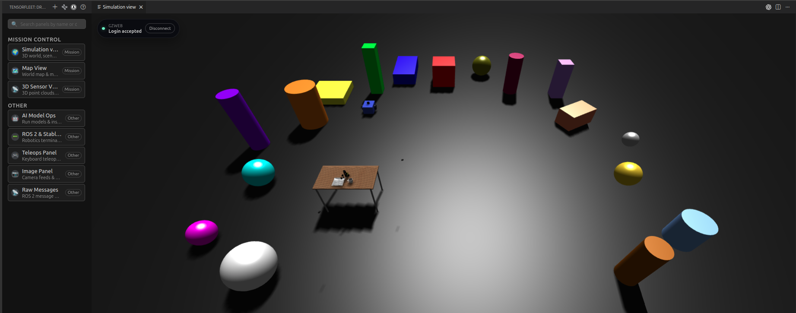
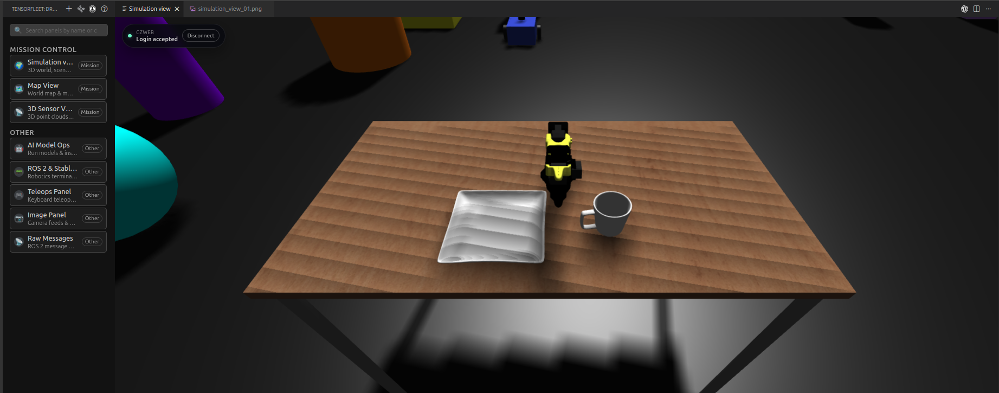
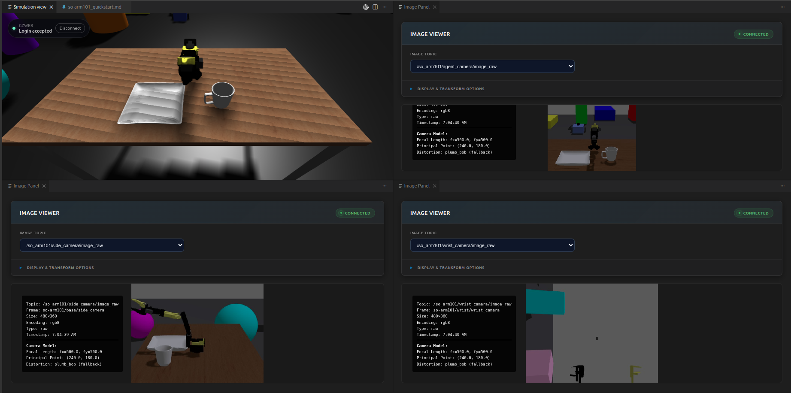
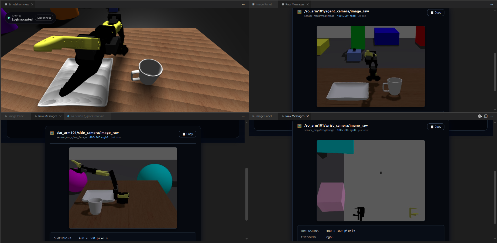

# SO-ARM101 Quick Start

1. **Start VM**: Click the **TensorFleet** status bar in VS Code and select **Start VM**.
2. **Setup Environment**: Install dependencies using `uv`.
   ```bash
   uv venv && uv pip install -r requirements.arm.txt
   ```
3. **Open Simulation**: Launch the **Simulation View** and zoom in on the table as shown.
   
   
4. **Monitor Camera Feeds**: Open several **Image Panels** and subscribe to these camera topics:
   - `/so_arm101/agent_camera/image_raw`
   - `/so_arm101/side_camera/image_raw`
   - `/so_arm101/wrist_camera/image_raw`
   

   **Tip: Using Raw Messages**
   For a more compact view of multiple topics, use the **Raw Messages** panel:
   - Open the **Raw Messages** panel.
   - Search for your topic in **Search Topics**.
   - Select the topic and click **Subscribe**.

   

5. **Run Teleoperation**: Start the keyboard control script:
   ```bash
   uv run python src/teleop_so_arm101.py
   ```
   > [!IMPORTANT]
   > Keyboard controls will only work when the **terminal window is focused**.

### Keyboard Controls

| Key | Action |
| --- | --- |
| `q` / `a` | Joint 1 +/- |
| `w` / `s` | Joint 2 +/- |
| `e` / `d` | Joint 3 +/- |
| `r` / `f` | Joint 4 +/- |
| `t` / `g` | Joint 5 +/- |
| `y` / `h` | Gripper open/close |
| `space` | Hold current position |
| `0` | Return to home position |
| `x` / `Ctrl-C` | Exit teleoperation |